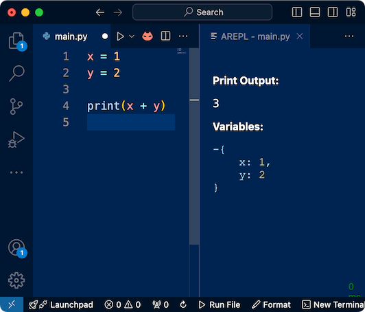

<!-- _class: title -->
<!-- _paginate: skip -->

# Introduction to programming

## Whakatakinga ki te kaupapa papatono

| | | | |
| --: | :-- | --: | :-- |
| **AS** | 92004 | **Credits** | 5 |
| **Level** | 1 | **Type** | Internal |
| **Date published** | Dec 2023 | **Version** | 3 |

| Paetae • A | Kaiaka • M | Kairangi • E |
| :-: | :-: | :-: |
| Create a computer program | Create a **refined** computer program | Create a **robust** computer program |

---

<!-- _class: lisc -->
<!-- _paginate: skip -->

# Learning intentions

## Koronga ako


**In this lesson, you will learn**:

1. what you will learn in this programming unit
2. what you must do to achieve the standard
3. how to write your first Python code

## Paearu angitū • Success criteria

**You will know that you have completed the intended learning when**:

1. you can describe what a computer program is
2. you can explain what programming is
3. you have written your first Python code

---

<!-- _class: division -->

# Introduction

## Whakatakinga

---

# Introduction

## Whakatakinga

Nau mai! Welcome to the programming unit in 11DIT Digital Technologies. In this unit, you will learn the skills needed to create a flexible, robust computer program.

You will learn about:

- maths operations
- variables
- Boolean algebra
- conditional statements
- loops
- lists

---

# About our learning

## Tō tātou ako

As part of your learning, you will:

- exercise your problem solving skills
- break tasks down into smaller pieces
- learn and apply mathematical theory, such as Boolean logic
- write program code in Python (or another language, after approval from your kaiako)
- test your code to ensure basic functionality
- complete **offline** learning tasks, including:
  - wānanga (class and group discussions)
  - games to teach computational thinking concepts
  - diagrams drawn on paper

---

# Assessment

## Aromatawai

At the end of the unit, your learning will be assessed against [AS92004: Create a computer program](https://www.nzqa.govt.nz/nqfdocs/ncea-resource/achievements/2024/as92004.pdf). To achieve this standard, you must:

- use a suitable programming language to construct a program that performs a specified task
- test and debug the program to ensure it works on expected cases
- document the program with comments

## When will the assessment take place?

There will be a formative (practice) assessment at the end of Term 1, then the summative (actual) assessment at the end of Term 2. This will take 4 full weeks of school time

---

<!-- _class: division -->

# He aha te papatono?

## What is programming?

---

# What is programming?

## He aha te papatono?

<span style="font-family: serif; font-size: 1.4em; font-style: italic;">“Programming is a collaboration between humans and computers.”</span>
~[Codecademy](https://www.codecademy.com/article/what-is-programming) 

Computers are **dumb**. They don't know how to do anything. All they can do is follow process basic maths instructions. At the heart of it, they can only move numbers around — `0`s and `1`s made of electricity.

Programming is the science **and** art of telling a computer what to do through the use of programming languages.

Computers get their brains from *us*.

---

# Programming languages

## Ngā reo papatono

In the past, it was necessary to communicate with the computer using maths. In fact, that's what a lot of programmers still do.

However, it isn't necessary to learn the intricate details of computer maths. Instead, we can use a **programming language** such as:

- Python
- C and C++
- JavaScript, etc.

These are **human-readable** languages. We can make sense of the programs because they use words and concepts familiar to us, such as `if`, `else`, and `while`

---

# Programming logic

## Whakakaupapa papatono

If programming is telling computers what to do, then programming languages provide the building blocks to reach your goals

Like anything you build, different materials have different purposes. Similarly, these programming building blocks have different purposes such as checking if two numbers are equal, if some text is a certain number of letters long, etc.

Some of these are written in the language using keywords such as `if`, `else`, or `while`. Otherwise are written using symbols such as `=`, `+`, and `-`

There's nothing magical to these. They're not mysterious incantations. They are just ways to express "do this" or "do that", steps that the computer can take to solve a problem for us

---

# Who is programming for?

## Mā wai te papatono?

Programming is for **everyone**!

Traditionally, programming was seen as being a natural fit for those who enjoy solving puzzles, are good at maths, or who learn human languages relatively easily

However, these are not mandatory at all!

Anybody can apply themselves to learn the logic of programming. Some people learn fast, some people take longer. There's no right or wrong speed to learning the computational thinking involved in programming

---

# Is it for women, too?

## Mā ngā wāhine hoki?

Computer science is stereotypically seen as a male-dominated industry. **This is not true!**

In fact, women and trans/non-binary figures make up some of the most important names in computer science history, such as:

- [Ada Lovelace](https://www.britannica.com/story/ada-lovelace-the-first-computer-programmer), the woman who wrote the first computer program ever
- [Grace Hopper](https://www.britannica.com/biography/Grace-Hopper), the woman who wrote the first compiler and first human-readable programming language, [Flow-Matic](https://en.wikipedia.org/wiki/FLOW-MATIC) which later influenced [COBOL](https://en.wikipedia.org/wiki/COBOL)
- [Lynn Conway](https://en.wikipedia.org/wiki/Lynn_Conway), the trans woman whose work at Xerox PARC pioneered the modern computer chip industry from which we continue to be benefit today

---

<!-- _class: division -->

# Tuhia tō papatono Python tuatahi

## Write your first Python program

---

# Task 1

## Mahi tuatahi

You will need to create a GitHub account in order to use our online programming platform, GitHub Codespaces. This is platform is used for completing your daily tasks and for the aromatawai at the end of the unit.

1. Follow the instructions to [create a GitHub account](https://sites.google.com/onslow.school.nz/digital-tech/help/github/create-an-account)
2. Follow the instructions to [accept your first GitHub Classroom assignment](https://sites.google.com/onslow.school.nz/digital-tech/help/github/accept-assignments)
3. Follow the instructions to [create your first GitHub Codespace](https://sites.google.com/onslow.school.nz/digital-tech/help/github/create-a-codespace)
4. When you think you have completed all of these instructions, raise your hand to check with your kaiako that you have completed them all correctly

---

# Task 2

## Mahi tuarua

<div class="columns">

<div>

1. In your GitHub Codespace, click on `main.py` in the  Explorer pane
2. At the top-right of the Codespace tab, click on the  AREPL icon (red cat)
3. In the `main.py` file, copy-paste the following code:
    ```python
    x = 1
    y = 2

    print(x + y)
    ```
4. Look at the **Print Output** at the top

</div>

<div>



</div>

</div>

---

# Task 3

## Mahi tuatoru

1. Try changing the values for `x` and `y`
2. Try using different maths symbols in the print statement. Try changing the `+` to:
   - `-` for subtraction
   - `*` for multiplication
   - `/` for division

---

# Quiz

## Patapātai

Complete the quiz in your Google Classroom assignment.

You will need to:

- answer the maths questions using the AREPL window by:
  - adjusting the values of `x` and `y`
  - changing the maths operation symbol inside the `print()` statement
- take screenshots of your code and AREPL window
- upload the screenshots to the quiz

---

<!-- _class: division -->

# Whakamutunga

## Conclusion

---

# Success criteria

## Paearu angitū

Now that this lesson has concluded, think about how confident you are in your understanding. Do you feel that:

1. you can describe what a computer program is?
2. you can explain what programming is?
3. that you understand how the maths worked in your program?
